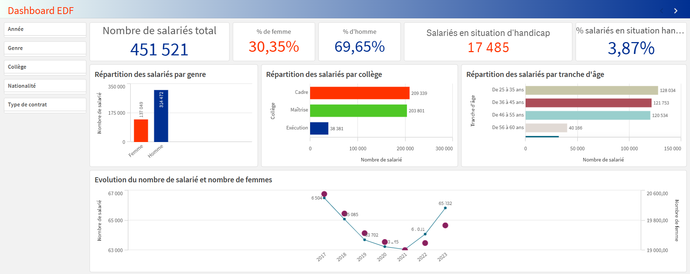

# 👷 Bilan Social EDF SA- Dashboard RH (Qlik Sense)


-darkblue?style=for-the-badge)

---

## 📋 Project Overview

This project is an **HR data visualization dashboard** built with **Qlik Sense**, analyzing the **EDF SA Social Report (Bilan Social)** from 2017 to 2023. It explores workforce composition, gender distribution, age structure, and the inclusion of employees with disabilities - all based on **public open data** from EDF.

---

## 📁 Datasets Used

| File | Description | Period |
|---|---|---|
| `bilan-social-d-edf-sa-effectifs-et-repartition-par-age-statut-et-sexe.csv` | Total EDF SA workforce by age, status and gender | 2017–2023 |
| `bilan-social-d-edf-sa-salaries-en-situation-de-handicap.csv` | Employees with disabilities (RQTH) | 2017–2023 |
| `insertion-des-travailleurs-en-situation-de-handicap-dans-le-groupe-edf.csv` | Disability inclusion in EDF Group | 2012–2023 |

> All data is sourced from **EDF's official open data portal** and the mandatory annual *Bilan Social*.

---

## 🛠️ Data Preparation (Qlik Script)

The data was loaded into a **single unified table** using `CONCATENATE`, with a `TypeIndicateur` field added to distinguish data sources:

```
Salaries table:
├── Source 1 → effectifs totaux     → TypeIndicateur = 'Total'
├── Source 2 → salariés handicap    → TypeIndicateur = 'Handicap'
└── Source 3 → travailleurs extér.  → TypeIndicateur = 'Extérieurs'
```

**Key transformations:**
- Decimal separator normalized: `replace(Valeur, ',', '.') * 1 as Valeur`
- Empty fields added for missing columns when concatenating tables (type de contrat, tranche d'âge, ancienneté...)
- `TypeIndicateur` tag added to each row to allow Set Analysis filtering in measures

---

## 📐 Measures (Set Analysis)

All measures use **Qlik Set Analysis** to filter on chapter `§1.1.6` of the social report:

| Measure | Expression |
|---|---|
| Total workforce | `sum({<[Chapitre du bilan social]={"§1.1.6"}, TypeIndicateur={'Total'}>}Valeur)` |
| Number of women | `sum({<..., Genre={"Femme"}>}Valeur)` |
| % women | `sum({<..., Genre={"Femme"}>}Valeur) / sum({<...>}Valeur)` |
| % men | `sum({<..., Genre={"Homme"}>}Valeur) / sum({<...>}Valeur)` |
| Employees with disabilities | `sum({<TypeIndicateur={'Handicap'}>}Valeur)` |
| % employees with disabilities | `sum({<TypeIndicateur={'Handicap'}>}Valeur) / sum({<..., TypeIndicateur={'Total'}>}Valeur)` |

---

## 📊 Key Metrics

### All years combined (2017–2023)

| Metric | Value |
|---|---|
| 👷 Total workforce (cumulated) | **451 521** |
| 👩 % Women | **30,35%** |
| 👨 % Men | **69,65%** |
| ♿ Employees with disabilities | **17 485** |
| ♿ % employees with disabilities | **3,87%** |

### Year 2022 only

| Metric | Value |
|---|---|
| 👷 Total workforce | **64 081** |
| 👩 % Women | **29,96%** |
| 👨 % Men | **70,04%** |
| ♿ Employees with disabilities | **2 602** |
| ♿ % disabilities | **4,06%** |

---

## 📈 Results & Analysis

### 1. Workforce Evolution (2017–2023)

| Year | Total | Women | Men |
|---|---|---|---|
| 2017 | ~66 500 | ~19 800 | ~46 700 |
| 2018 | ~65 085 | ~19 800 | ~45 285 |
| 2019 | ~63 702 | ~19 600 | ~44 102 |
| 2020 | ~63 345 | ~19 300 | ~44 045 |
| 2021 | ~63 045 | ~19 100 | ~43 945 |
| 2022 | **64 081** | **19 196** | **44 885** |
| 2023 | ~65 132 | ~19 600 | ~45 532 |

> **Key insight:** After a continuous decline from 2017 to 2021 (likely driven by retirements and restructuring), EDF's workforce rebounded in 2022–2023, probably linked to nuclear energy investments and new recruitment.

---

### 2. Gender Distribution

- **~70% men / ~30% women** consistently across all years
- The gender gap is **structural and persistent** - it barely moves year over year
- Women are more represented in **Cadre** (management) roles proportionally, suggesting better access to senior positions for women who do join the company

> **Key insight:** The 70/30 split reflects the energy sector's traditionally male-dominated profile. However, the share of women has been **slowly increasing** over the period, which may indicate diversity efforts bearing fruit over the long term.

---

### 3. Distribution by College (Job Category)

| College | 2022 Count |
|---|---|
| Cadre (Management) | 30 498 |
| Maîtrise (Supervisory) | 28 614 |
| Exécution (Operational) | 4 969 |

> **Key insight:** EDF SA has a **top-heavy structure** - nearly half of all employees are classified as Cadres. This reflects the highly technical and qualified nature of nuclear and energy operations.

---

### 4. Age Distribution (2022)

| Age Group | Count |
|---|---|
| 36–45 ans | **18 171** (largest group) |
| 46–55 ans | 17 212 |
| 25–35 ans | 16 480 |
| 56–60 ans | 5 851 |

> **Key insight:** The workforce is **aging**, with the 36–55 age bracket representing nearly 55% of all employees. The 56–60 group (approaching retirement) represents ~9%, suggesting a **significant wave of retirements** is coming. This could explain the recent uptick in recruitment observed in 2022–2023.

---

### 5. Disability Inclusion (RQTH)

**EDF SA - Salariés en situation de handicap:**

| Year | Count | YoY Change |
|---|---|---|
| 2017 | 2 320 | - |
| 2018 | 2 375 | +2.4% |
| 2019 | 2 390 | +0.6% |
| 2020 | 2 505 | +4.8% |
| 2021 | 2 540 | +1.4% |
| 2022 | 2 602 | +2.4% |
| 2023 | 2 753 | **+5.8%** |

**EDF Group (Groupe EDF) - broader scope:**

| Year | Count | % |
|---|---|---|
| 2012 | 4 519 | - |
| 2017 | 5 279 | 3.40% |
| 2019 | 5 682 | 3.40% |
| 2021 | 6 454 | 3.86% |
| 2022 | 6 791 | 3.96% |
| 2023 | **7 054** | **3.93%** |

> **Key insight:** The number of employees with disabilities has **increased every single year**, both at EDF SA and Group level. The rate reached ~4% in 2022–2023, approaching but still below the French legal obligation of **6% (OETH)**. The acceleration in 2023 (+5.8%) suggests intensified efforts to meet this target.

**By college (2022):**
- Maîtrise: 1 435 (highest count)
- Cadre: 825 (growing fastest)
- Exécution: 342 (declining - fewer operational roles overall)

---

## 💡 Key Recommendations

Based on the analysis, here are key recommendations for EDF's HR strategy:

**1. Address the gender gap proactively**
The 70/30 split has barely moved in 7 years. Targeted recruitment, mentoring programs, and visibility of female role models in technical roles could accelerate progress.

**2. Prepare for the retirement wave**
With ~9% of employees aged 56–60 in 2022, EDF faces a significant knowledge transfer challenge. Succession planning and apprenticeship programs should be prioritized.

**3. Accelerate RQTH hiring to meet the 6% legal obligation**
At 4.06% in 2022, EDF SA is still ~2 points below the legal threshold. Partnerships with specialized employment agencies (ESAT, Cap Emploi) and internal awareness campaigns could help close the gap.

**4. Monitor the Cadre growth trend**
The growing share of Cadre employees vs. Exécution reflects the company's skill upgrading strategy. However, it's important to ensure this doesn't create a disconnect with operational needs on the ground.

---

## 🗺️ Dashboards

### Dashboard EDF - All years (2017–2023)


### Dashboard EDF - 2022 only


Both dashboards include:
- KPI bar: total workforce, % women, % men, number of RQTH employees, % RQTH
- Bar chart: gender distribution
- Bar chart: distribution by college (Cadre / Maîtrise / Exécution)
- Bar chart: distribution by age group
- Dual-axis line chart: workforce evolution + number of women over time
- Filter panel: Année, Genre, Collège, Nationalité, Type de contrat

---

## 🔧 Tools & Technologies

- **Qlik Sense** - data modeling, scripting (Set Analysis), dashboard creation
- **Excel / CSV** - source data from EDF open data portal
- **Open Data EDF** - [opendata.edf.fr](https://opendata.edf.fr)

---

<!-- VERSION FRANÇAISE

# 👷 Bilan Social EDF - Dashboard RH (Qlik Sense)

## 📋 Présentation du projet

Ce projet est un tableau de bord de visualisation RH réalisé avec Qlik Sense, analysant le Bilan Social d'EDF SA de 2017 à 2023. Il explore la composition des effectifs, la répartition par genre, la structure par âge et l'inclusion des travailleurs en situation de handicap, à partir des données ouvertes officielles d'EDF.

## 📁 Jeux de données utilisés

- bilan-social-d-edf-sa-effectifs-et-repartition-par-age-statut-et-sexe.csv - Effectifs totaux EDF SA par âge, statut et sexe (2017–2023)
- bilan-social-d-edf-sa-salaries-en-situation-de-handicap.csv - Salariés RQTH EDF SA (2017–2023)
- insertion-des-travailleurs-en-situation-de-handicap-dans-le-groupe-edf.csv - Insertion handicap Groupe EDF (2012–2023)

Toutes les données proviennent du portail open data officiel d'EDF et du Bilan Social annuel obligatoire.

## 🛠️ Préparation des données (Script Qlik)

Les 3 sources ont été chargées dans une table unique via CONCATENATE, avec un champ TypeIndicateur ajouté pour distinguer les sources :
- Source 1 → effectifs totaux → TypeIndicateur = 'Total'
- Source 2 → salariés handicap → TypeIndicateur = 'Handicap'
- Source 3 → travailleurs extérieurs → TypeIndicateur = 'Extérieurs'

Transformation clé : replace(Valeur, ',', '.') * 1 pour normaliser les décimales

## 📊 Indicateurs clés

Toutes années confondues (2017–2023) :
- Effectif total cumulé : 451 521
- % Femmes : 30,35%
- % Hommes : 69,65%
- Salariés en situation de handicap : 17 485
- % RQTH : 3,87%

Année 2022 uniquement :
- Effectif total : 64 081
- % Femmes : 29,96%
- Salariés RQTH : 2 602
- % RQTH : 4,06%

## 📈 Résultats & Analyse

1. Evolution des effectifs (2017–2023)
Baisse continue de 2017 à 2021, puis rebond en 2022–2023, probablement lié aux investissements dans le nucléaire et aux nouvelles recrues.

2. Répartition par genre
Ratio stable ~70% hommes / ~30% femmes sur toute la période. Le secteur de l'énergie reste très masculin mais la part des femmes progresse lentement.

3. Répartition par collège
Cadre : 30 498 | Maîtrise : 28 614 | Exécution : 4 969
Structure très qualifiée reflétant la nature technique des métiers du nucléaire.

4. Pyramide des âges
La tranche 36–55 ans représente ~55% des effectifs. La tranche 56–60 ans (~9%) annonce une vague de départs à la retraite imminente.

5. Inclusion handicap (RQTH)
Progression constante : 2 320 en 2017 → 2 753 en 2023 (+18,7%).
Taux de 4,06% en 2022, encore en dessous de l'obligation légale de 6% (OETH).

## 💡 Recommandations
1. Réduire l'écart de genre par des programmes de recrutement ciblés
2. Anticiper la vague de départs à la retraite (9% de 56–60 ans)
3. Accélérer le recrutement RQTH pour atteindre le seuil légal de 6%
4. Surveiller l'évolution de la structure des collèges face aux besoins opérationnels

-->
